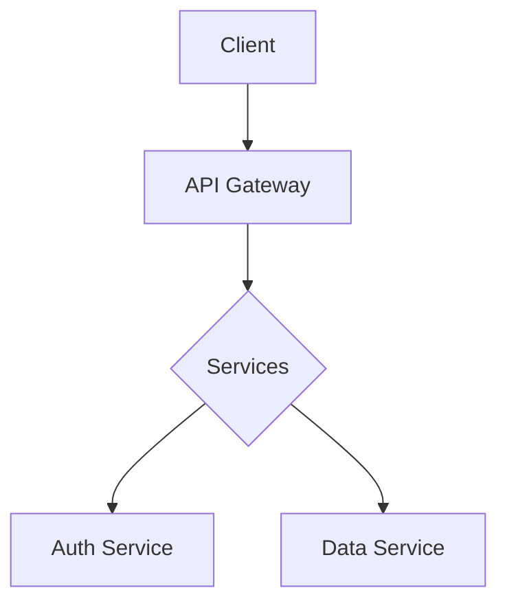

# Sample: Product Architecture Overview

This document describes the product architecture and rollout plan.

## Goals

- Launch MVP in Q3
- Validate core assumptions

## Architecture

## Roadmap

- Phase 1: Core features
- Phase 2: Scaling and monitoring

## Summary

This deck summarizes goals, architecture and roadmap.